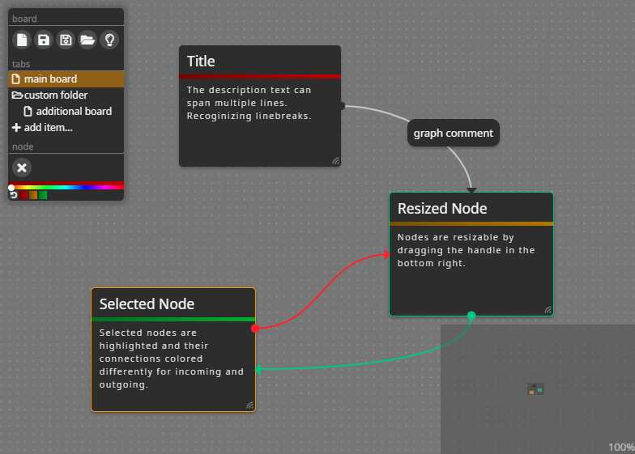

# Node Editor
> An intuitive editor for layouts of nodes and graphs.

The intention of this tool is to provide a free (meaning free to use, alter and distribute) editor for outlining mind-maps without hindering menus and configuration. That makes the waiver of hidden sub- and context-menus and a simple predefined style the main design principles of the project. Though customization of the look is still easily feasible through dedicated stylesheets.

Examples of the default layout and styling in a dark and light theme are:




## Build instructions

The project requires an installation of [Node.js](https://nodejs.org) including its own package management system to satisfy all further dependencies. Those modules listed in the _packages.json_ are obtained automatically by executing the following line in the working tree root directory:

```sh
npm install
```

Following that you can run the program from source by executing:

```sh
npm start
```

And you can also use the next line to package the program as a self-containing executable:

```sh
npm run dist
```

## Main features

#### Unhindered handling
#### Multiple boards
#### Mini-map

## Third Party

* __Node.js__: Node.js JavaScript runtime (https://nodejs.org)

Obtained through Node.js package management (NPM):

* __Electron__: Build cross platform desktop apps with JavaScript, HTML, and CSS (https://www.npmjs.com/package/electron)

* __electron-builder__: A complete solution to package and build a ready for distribution Electron app for MacOS, Windows and Linux with “auto update” support out of the box (https://www.npmjs.com/package/electron-builder)

* __electron-localshortcut__: Register/unregister a keyboard shortcut locally to a BrowserWindow instance, without using a Menu (https://www.npmjs.com/package/electron-localshortcut)

* __ESLint__: An AST-based pattern checker for JavaScript (https://www.npmjs.com/package/eslint)

* __eslint-config-google__: ESLint shareable config for the Google style (https://www.npmjs.com/package/eslint-config-googl)

* __jQuery__: JavaScript library for DOM operations (https://www.npmjs.com/package/jquery)

* __Font Awesome__: The iconic font and CSS framework (https://www.npmjs.com/package/font-awesome)

## Contribution

1. Fork it (<https://github.com/rzllmr/node-editor/fork>)
2. Create your feature branch (`git checkout -b feature/example`)
3. Commit your changes (`git commit -am 'Change something'`)
4. Push to the branch (`git push origin feature/example`)
5. Create a new Pull Request

## License

Licensed under the [MIT license](https://github.com/rzllmr/node-editor/blob/master/LICENSE).
